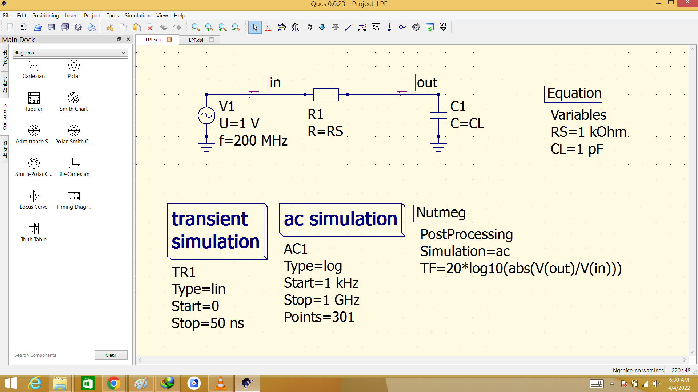
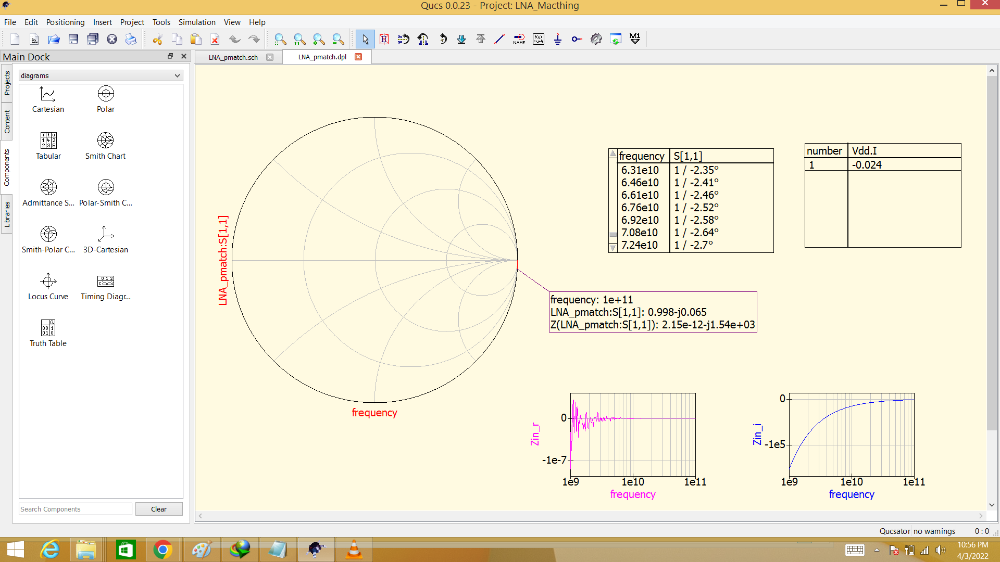
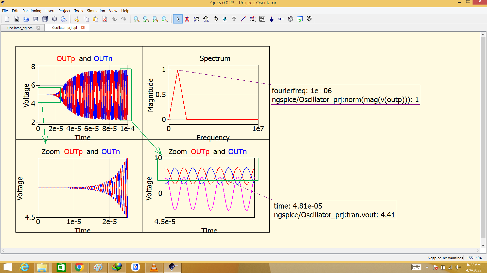

# RF-and-millimeter-Wave-Circuit-Design
RF and millimeter-Wave Circuit Design

  * [System Design Specification and Architecture](#System-Design-Specification-and-Architecture)
  * [Low Pass Filter](#Low-Pass-Filter)
  * [Amplifier](#Amplifier)
  * [Mixer](#Mixer)
  * [Oscillator](#Oscillator)
  * [Synthesizer](#Synthesizer)
  
## System Design Specification and Architecture

##### Calculation

##### System Simulation

## Low Pass Filter

## Amplifier
##### Common Source Amplifier

##### Low Noise Amplifier

##### LNA with Parasitics

##### Matched LNA with Parasitics

##### Power Amplifier

##### Amplifier Measured Data

## Mixer
##### Passive Mixer

##### Passive Mixer TIA

##### Single Balanced Mixer

##### Active Mixer

##### Balun

##### Mixer Measured Data

## Oscillator

##### Barkhausen Oscillator

##### Voltaged Controlled Oscillator

##### Oscillator Measured Data

## Synthesizer
##### PLL type 1

##### PLL type 2

##### Synthesizer int fixed

##### Synthesizer int programmable

##### Synthesizer fractopmal programmable

##### Pll design

